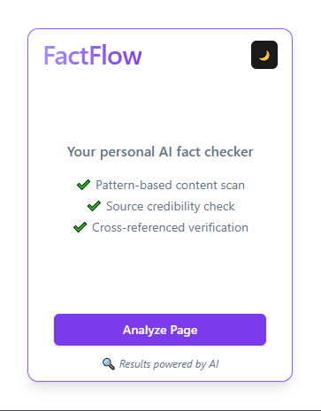
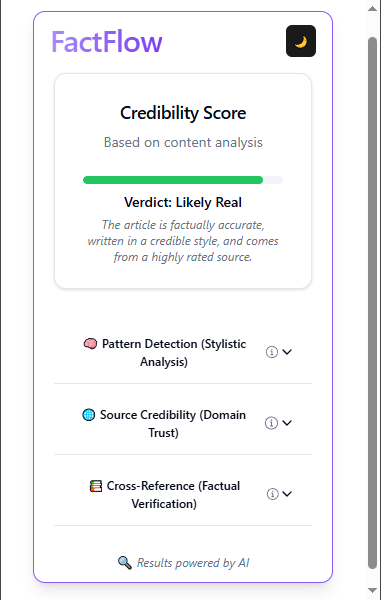
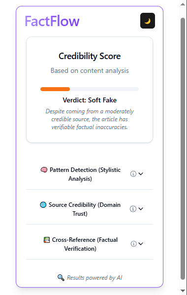

<h1 align="center">FactFlow</h1>
<h3 align="center">Your Personal AI Fact Checker — Built as a Multi-layered Browser Extension</h3>

 

> 🔍 In an age of misinformation, **FactFlow** empowers users to navigate online news with confidence.

FactFlow is an intelligent browser extension designed to **analyze and validate news articles in real-time**.  
By combining the power of **Natural Language Processing, source credibility checks, and AI-based cross-referencing**,  
FactFlow delivers a **layered analysis** to help you identify fake, misleading, or unverifiable content — directly as you browse.

Whether it's political headlines or trending stories, **FactFlow helps you verify before you trust.**

## 🔧 Key Features

- 🧠 **3-Layered Verification System**
  - Pattern-based ML model trained on LIAR dataset
  - Source credibility score using MBFC database
  - Factual cross-checking with real-time LLM support

- ⚡ **One-Click Analysis**
  - Scrapes and processes the current web page automatically

- 🟩 **Credibility Verdict Bar**
  - Displays clear verdicts like: Fake, Soft Fake, Likely Real, Uncertain

- 🌐 **Chrome Extension UI**
  - Minimalistic interface built with React + Tailwind + ShadCN
  - Circular animated progress loader and hover effects

- 📡 **FastAPI Backend**
  - Unified API that integrates model inference, source scoring, and LLM calls

## ⚙️ Built With

#### 💻 Frontend  

#### 🧠 Backend  

#### 📊 Machine Learning  

#### 🧩 Tools & Integrations  

## 🧪 Multi-Layered Verification Pipeline

FactFlow analyzes content using **three distinct yet complementary layers**:

#### 1️⃣ Pattern-Based Detection (ML)
- Uses a fine-tuned **RoBERTa-Large** model trained on the **LIAR dataset**
- Analyzes language style, semantic patterns, exaggeration, and bias indicators

#### 2️⃣ Source Credibility Check
- Looks up the article’s source in the **Media Bias/Fact Check (MBFC)** database
- Uses source credibility scores and bias ratings to assess trustworthiness

#### 3️⃣ Factual Cross-Reference
- Utilizes the **Gemini LLM API** to verify key claims
- Checks if claims are supported or contradicted by factual sources across the web

> ✅ Final Verdicts like `Fake`, `Soft Fake`, or `Likely Real` are assigned by a custom decision engine that aggregates all three layers.

## 🖼️ Live Demo

  
  &nbsp;&nbsp;&nbsp;
  
  &nbsp;&nbsp;&nbsp;
  

> 🎥 The extension scans the page, runs all 3 verification layers in real-time, and displays a final verdict with animated feedback and progress tracking.

## 📊 Performance & Results

#### 🔍 Pattern-Based Model
- **Model**: Fine-tuned BERT on LIAR Dataset
- **Accuracy**: `87.3%`
- **F1 Score**: `0.88`
- **Data**: 15k labeled political statements

#### ✅ Verdict Mapping
The final credibility verdict is determined by a custom decision engine that synthesizes all three layers:

| Layer                    | Signal                     | Outcome Example      |
|-------------------------|----------------------------|----------------------|
| Pattern-Based           | FAKE                       | 🟧 Soft Fake          |
| Source Score < 20       | Questionable or Satire     | 🟥 Fake              |
| Cross-Reference         | Contradicted key claims    | 🟥 Fake              |
| All Layers Agree (Real) | Factual, Credible, Clean   | 🟩 Likely Real       |
| Conflicting Layers      | Mixed results or missing   | 🟨 Uncertain         |

> 🧠 These verdicts are dynamically computed using a hybrid rule-based and AI-supported decision engine.

## 📖 Academic Recognition

📝 FactFlow was presented at the  
**IEEE 16th International Conference on Computing, Communication and Networking Technologies (ICCCNT 2025)**  
📍 **IIT Indore, India**  
📅 **July 2025**

> 🎓 The paper introduces FactFlow as a novel browser-based misinformation detection framework, combining stylistic pattern analysis, source credibility evaluation, and content-aware LLM verification.

- 🏅 **Status**: Accepted for publication in IEEE Xplore
- 📌 **Title**: *FactFlow: A Multi-Layered Fake News Detection System Using Pattern-Based and Content-Aware Machine Learning*
- 🔗 [IEEE Conference Website](https://www.icccnt.in)

Full paper coming soon to **IEEE Xplore Digital Library** 📚

